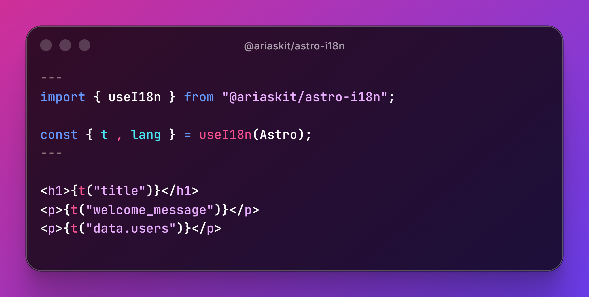

# @ariaskit/astro-i18n

Simple internationalization (i18n) library for Astro with TypeScript support.



## Installation

```bash
npm install @ariaskit/astro-i18n
# or
pnpm add @ariaskit/astro-i18n
# or
yarn add @ariaskit/astro-i18n
```

## Setup

1. Create your translation files in `src/i18n/`:

```
src/
  i18n/
    en.json
    es.json
```

**Example `en.json`:**
```json
{
  "title": "Welcome",
  "welcome_message": "Hello World",
  "data": {
    "users": "Users",
    "settings": "Settings"
  }
}
```

**Example `es.json`:**
```json
{
  "title": "Bienvenido",
  "welcome_message": "Hola Mundo",
  "data": {
    "users": "Usuarios",
    "settings": "Configuración"
  }
}
```

2. Enable JSON imports in `tsconfig.json`:
```json
{
  "compilerOptions": {
    "resolveJsonModule": true
  }
}
```

## Usage

### With TypeScript (Recommended)

TypeScript support is **optional** but provides autocompletion for translation keys.

```astro
---
import { useI18n } from "@ariaskit/astro-i18n";
import en from "../i18n/en.json";

const { t, lang } = useI18n<typeof en>(Astro);
---

<h1>{t("title")}</h1>
<p>{t("welcome_message")}</p>
<p>{t("data.users")}</p>
```

### Without TypeScript

```astro
---
import { useI18n } from "@ariaskit/astro-i18n";

const { t, lang } = useI18n(Astro);
---

<h1>{t("title")}</h1>
<p>{t("welcome_message")}</p>
```

## Variables/Interpolation

You can use variables in your translations using the `{{variableName}}` syntax.

**Example JSON:**
```json
{
  "welcome": "Welcome, {{name}}!",
  "greeting": "Hello {{name}}, you have {{count}} messages",
  "data": {
    "users": "Users {{name}}"
  }
}
```

**Usage:**
```astro
---
import { useI18n } from "@ariaskit/astro-i18n";
import en from "../i18n/en.json";

const { t } = useI18n<typeof en>(Astro);
---

<h1>{t("welcome", { name: "Victor" })}</h1>
<h2>{t("data.users", { name: "Victor" })}</h2>
<p>{t("greeting", { name: "Victor", count: 5 })}</p>
```

**Output:**
```html
<h1>Welcome, Victor!</h1>
<h2>Users Victor</h2>
<p>Hello Victor, you have 5 messages</p>
```

## Routing Strategies

### Option 1: Dynamic Routes with `[lang]` param

```
src/
  pages/
    [lang]/
      index.astro
      about.astro
```

```astro
---
import { useI18n } from "@ariaskit/astro-i18n";
import en from "../../i18n/en.json";
import type { GetStaticPaths } from "astro";

export const getStaticPaths = (() => {
  return [
    { params: { lang: "en" } },
    { params: { lang: "es" } }
  ];
}) satisfies GetStaticPaths;

const { t, lang } = useI18n<typeof en>(Astro);
---

<html lang={lang}>
  <body>
    <h1>{t("title")}</h1>
    <p>{t("welcome_message")}</p>
  </body>
</html>
```

### Option 2: Folder Structure (`/en`, `/es`)

```
src/
  pages/
    en/
      index.astro
      about.astro
    es/
      index.astro
      about.astro
```

Works the same way. The library detects the locale from `Astro.currentLocale` or `Astro.params.lang`.

### Option 3: Astro i18n Routing (Recommended)

```javascript
// astro.config.mjs
export default defineConfig({
  i18n: {
    defaultLocale: 'en',
    locales: ['en', 'es']
  }
});
```

```astro
---
// No need for getStaticPaths
const { t, lang } = useI18n<typeof en>(Astro);
---
```

## API

### `useI18n<T>(astro: AstroGlobal)`

Returns:
- `t(key: string)`: Translation function with dot notation support
- `lang`: Current detected language
- `changeLocale(newLang: string)`: Returns a new URL string with the updated locale

**Language detection priority:**
1. `Astro.currentLocale` (from Astro i18n config)
2. `Astro.params.lang` (from dynamic routes)
3. `'en'` (fallback)

### Changing Language

Use `changeLocale` to generate URLs for language switching:

```astro
---
import { useI18n } from "@ariaskit/astro-i18n";
import type en from "../i18n/en.json";

const { t, lang, changeLocale } = useI18n<typeof en>(Astro);
---

<h1>{t("title")}</h1>

<!-- Language switcher -->
<nav>
  <a href={changeLocale("en")}>English</a>
  <a href={changeLocale("es")}>Español</a>
  <a href={changeLocale("fr")}>Français</a>
</nav>

<!-- Current URL: /es/about -> changeLocale("en") returns "/en/about" -->
```

## Features

- ✅ TypeScript autocomplete for translation keys
- ✅ Nested translations with dot notation (`data.users`)
- ✅ Variable interpolation with `{{variableName}}` syntax
- ✅ Works with all Astro routing strategies
- ✅ Language switcher with `changeLocale`
- ✅ Zero configuration needed
- ✅ Lightweight and fast

## License

MIT
